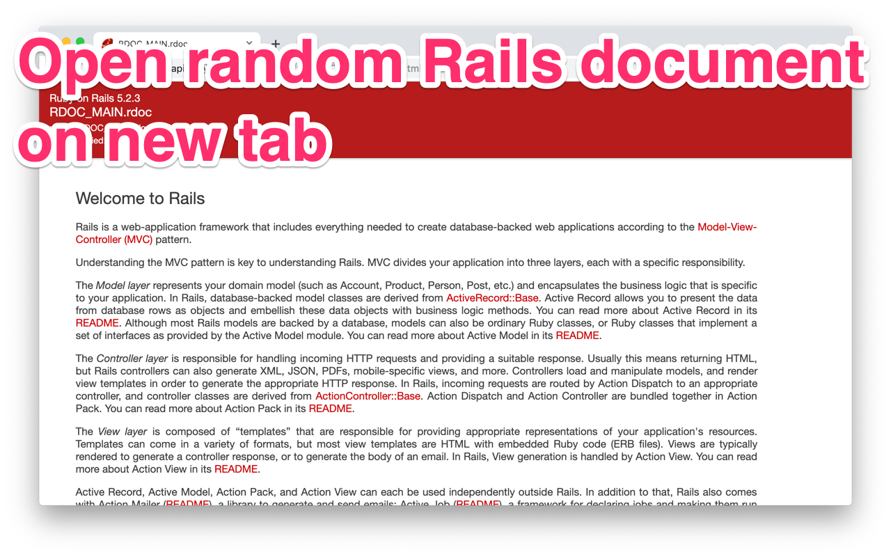

# Random Rails API tab

> Chrome extension to open random Ruby on Rails API document on new tab



## Installation

- **Chrome**: https://chrome.google.com/webstore/detail/random-rails-api-tab/ngbeahjnndjoedgapccnoennbmalppbk

## Features

- Open random Ruby on Rails API document (https://api.rubyonrails.org/) on new tab

## Development

### Requirements

- `python3`, `pipenv` for scraping data
- `node`, `npm` for building extension

### Setup

```
$ pipenv install
$ npm install
```

### Scrape

```
$ npm run crawler:start
```

Be careful that it may take minutes to complete.

### Build

```
$ npm run build
```

The extension is bundled into `extension/public` directory. Load `extension/public` directory to browser.

### Build and zip for production

```
$ npm run build -- -p
$ npm run zip
```

`chrome-${version}.zip` is created in `dist` directory.

## Credits

[Ruby on Rails icon](https://www.iconfinder.com/icons/3069735/circle_programming_rails_round_icon_ruby_ruby_rails_icon) by Abhishek Pipalva is licensed under CC BY-SA 3.0.

## License

[MIT](https://choosealicense.com/licenses/mit/)
